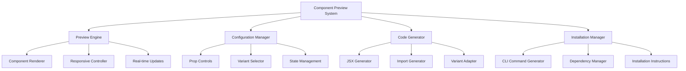

# Design Document

## Overview

The Component Preview System will enhance the existing React Bits demo infrastructure by creating a unified, interactive preview interface that allows developers to explore components with real-time prop configuration, code generation, and installation commands. The system will build upon the current TabsLayout structure while adding advanced customization capabilities, responsive preview options, and shareable configurations.

## Architecture

### High-Level Architecture



### System Integration

The Component Preview System will integrate with the existing React Bits infrastructure:

- **Current Demo Components**: Extend existing demo components (e.g., `AnimatedListDemo.jsx`) with enhanced preview capabilities
- **TabsLayout**: Enhance the existing `TabsLayout` component with new preview features
- **Registry System**: Leverage the existing `registry.json` for component metadata and installation commands
- **Build System**: Integrate with the current build pipeline for code generation across variants

## Components and Interfaces

### Core Components

#### 1. EnhancedPreviewTab
Extends the current `PreviewTab` with advanced features:

```typescript
interface EnhancedPreviewTabProps {
  component: ReactComponent;
  defaultProps: Record<string, any>;
  propSchema: PropSchema[];
  variants: ComponentVariant[];
  responsiveBreakpoints?: ResponsiveBreakpoint[];
  onConfigurationChange?: (config: ComponentConfiguration) => void;
}
```

#### 2. InteractivePropControls
Dynamic prop control system that generates appropriate input controls based on prop types:

```typescript
interface PropControlsProps {
  propSchema: PropSchema[];
  currentValues: Record<string, any>;
  onChange: (propName: string, value: any) => void;
  variant: ComponentVariant;
}

interface PropSchema {
  name: string;
  type: 'string' | 'number' | 'boolean' | 'select' | 'color' | 'range';
  default: any;
  options?: any[];
  min?: number;
  max?: number;
  step?: number;
  description: string;
  category?: string;
}
```

#### 3. CodeGenerationEngine
Generates code for different component variants:

```typescript
interface CodeGenerationEngineProps {
  componentName: string;
  currentProps: Record<string, any>;
  variant: ComponentVariant;
  includeImports: boolean;
}

interface ComponentVariant {
  id: string;
  name: string;
  language: 'js' | 'ts';
  styling: 'css' | 'tailwind';
  path: string;
  dependencies: string[];
}
```

#### 4. ResponsivePreviewContainer
Handles responsive preview functionality:

```typescript
interface ResponsivePreviewContainerProps {
  children: React.ReactNode;
  breakpoints: ResponsiveBreakpoint[];
  currentBreakpoint: string;
  onBreakpointChange: (breakpoint: string) => void;
}

interface ResponsiveBreakpoint {
  id: string;
  name: string;
  width: number;
  height?: number;
  icon: React.ReactNode;
}
```

#### 5. ShareableConfigurationManager
Manages configuration sharing and URL state:

```typescript
interface ShareableConfigurationManagerProps {
  configuration: ComponentConfiguration;
  onConfigurationLoad: (config: ComponentConfiguration) => void;
}

interface ComponentConfiguration {
  componentName: string;
  variant: ComponentVariant;
  props: Record<string, any>;
  breakpoint: string;
  timestamp: number;
}
```

### Data Models

#### Component Metadata Schema
```typescript
interface ComponentMetadata {
  name: string;
  title: string;
  description: string;
  category: 'TextAnimations' | 'Animations' | 'Components' | 'Backgrounds';
  variants: ComponentVariant[];
  propSchema: PropSchema[];
  dependencies: string[];
  examples?: ComponentExample[];
}

interface ComponentExample {
  name: string;
  description: string;
  props: Record<string, any>;
  code?: string;
}
```

#### Registry Integration Schema
```typescript
interface RegistryIntegration {
  registryItems: RegistryItem[];
  getComponentMetadata: (componentName: string) => ComponentMetadata;
  getInstallationCommand: (variant: ComponentVariant) => string;
  getDependencies: (variant: ComponentVariant) => string[];
}
```

## Error Handling

### Prop Validation
- Real-time validation of prop values against schema
- Display validation errors inline with controls
- Prevent invalid configurations from breaking preview
- Graceful fallback to default values for invalid props

### Component Loading
- Handle missing component variants gracefully
- Display loading states during component switching
- Error boundaries for component rendering failures
- Fallback UI for unsupported components

### Code Generation
- Validate generated code syntax
- Handle missing imports or dependencies
- Provide error messages for generation failures
- Fallback to basic code templates when advanced generation fails

### URL State Management
- Validate shared configuration URLs
- Handle malformed or expired configuration links
- Graceful degradation for unsupported configurations
- Error recovery for URL parsing failures

## Testing Strategy

### Unit Testing
- **Prop Controls**: Test all input control types with various prop schemas
- **Code Generation**: Verify correct code output for all variants and prop combinations
- **Configuration Management**: Test serialization/deserialization of configurations
- **Responsive Controls**: Validate breakpoint switching and container resizing

### Integration Testing
- **Component Rendering**: Test preview rendering with real React Bits components
- **Registry Integration**: Verify correct metadata extraction from registry.json
- **URL State**: Test configuration sharing and loading workflows
- **Build Integration**: Ensure compatibility with existing build pipeline

### End-to-End Testing
- **User Workflows**: Test complete user journeys from component discovery to installation
- **Cross-browser**: Verify functionality across different browsers and devices
- **Performance**: Test with large numbers of components and complex configurations
- **Accessibility**: Ensure keyboard navigation and screen reader compatibility

### Performance Testing
- **Rendering Performance**: Measure preview update times with complex components
- **Memory Usage**: Monitor memory consumption with multiple active previews
- **Code Generation Speed**: Benchmark code generation for large component sets
- **Bundle Size Impact**: Measure impact on overall application bundle size

## Implementation Phases

### Phase 1: Core Preview Enhancement
- Extend existing demo components with enhanced prop controls
- Implement real-time preview updates
- Add basic code generation for current variants
- Integrate with existing TabsLayout structure

### Phase 2: Advanced Features
- Add responsive preview functionality
- Implement comprehensive prop control types
- Create shareable configuration system
- Add installation command generation

### Phase 3: Integration and Polish
- Full registry.json integration
- Performance optimizations
- Comprehensive error handling
- Accessibility improvements
- Documentation and examples

## Technical Considerations

### Performance Optimizations
- Debounced prop updates to prevent excessive re-renders
- Lazy loading of component variants
- Memoization of generated code
- Virtual scrolling for large component lists

### Accessibility
- Keyboard navigation for all controls
- Screen reader support for prop descriptions
- High contrast mode compatibility
- Focus management for modal interactions

### Browser Compatibility
- Support for modern browsers (Chrome 90+, Firefox 88+, Safari 14+)
- Progressive enhancement for older browsers
- Responsive design for mobile devices
- Touch gesture support for mobile interactions

### Security Considerations
- Sanitize user input in prop controls
- Validate generated code before display
- Secure URL parameter handling
- XSS prevention in dynamic content rendering